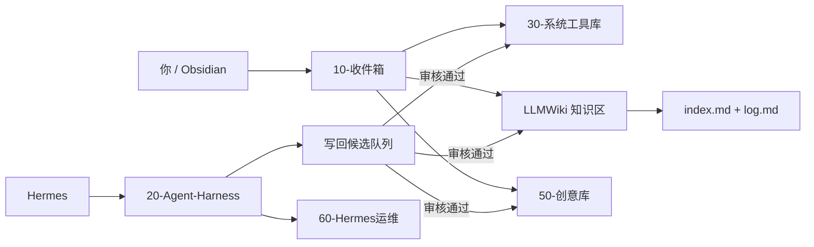

# Agent Foundry Vault智能体工坊

> Obsidian × LLMWiki × Hermes 的 Agent 训练、知识与运维中枢

这是一套可以直接作为 Obsidian Vault 打开的 Agent 训练、知识与运维中枢。它把四件事放进同一套可审计目录：

- 用 Obsidian 记录、浏览和人工审阅；
- 用 LLMWiki 维护可追溯的 Markdown 知识页；
- 用 Hermes 执行技能、任务与运维流程；
- 用 Harness 做任务回放、评测和逐步改进。

第一次使用时，不要从规则文件开始读。打开 [00-开始这里/10分钟首跑.md](00-开始这里/10分钟首跑.md)，照着完成一条真实记录即可。

## 先跑通这两条命令

纯 Obsidian 记录不需要 Node.js。要运行检查与 Harness 时，准备 Node.js 22 或更高版本；在本目录打开 PowerShell，先用 `node --version` 确认，再运行：

```powershell
node scripts/verify-repo.mjs
node scripts/harness-smoke.mjs
```

第一条检查目录、JSON/JSONL、链接与安全边界；第二条只验证 Harness 管线能走通。Mock 通过不代表真实模型质量合格。

## 一张图看懂



## 四个组件各管什么

| 组件 | 负责 | 不负责 |
|---|---|---|
| Obsidian | 人类编辑、链接、搜索、回看 | 运行 Agent、替你批准写回 |
| LLMWiki | `raw → concepts/entities/comparisons/queries` 的编译型知识维护 | 保存秘密、保存全部聊天、替代备份 |
| Hermes | 调用技能、执行任务、组织运行与复盘 | 把未审核输出直接当正式知识 |
| Harness | 任务协议、路由、trace、证据、评测和 A/B 对比 | 自动证明某个模型“更聪明” |

## 默认只看这些目录

- [00-开始这里](00-开始这里/)：新手入口和学习路线。
- [10-收件箱](10-收件箱/)：还没决定放哪里的内容。
- [30-系统工具库](30-系统工具库/)：方法、SOP、规范、清单。
- [40-Wiki知识库](40-Wiki知识库/)：知识摄入和查询说明。
- [50-创意库](50-创意库/)：灵感、世界观、角色与 ST 产出链。

以下内容是后台，不必第一天学习：

- [20-Agent-Harness](20-Agent-Harness/)：Agent 训练与评测。
- [60-Hermes运维](60-Hermes运维/)：运行记录、Skill、事件与复盘。
- [70-协同桥接](70-协同桥接/)：Obsidian、LLMWiki、Hermes 的接口边界。
- `raw/`、`concepts/`、`entities/`、`comparisons/`、`queries/`：LLMWiki 的根目录协议。

## 三条运行路线

1. `direct`：低风险、无需外部证据、只读或直接回答。
2. `research`：需要来源、冲突处理或多步检索，但不改正式库。
3. `governed-write`：任何正式写回、重命名、移动、执行或外部副作用。

路线越高，验证和人工门禁越严格。不要为了“多 Agent”而让简单任务走完整流水线。

## 完成标准

你真正上手的标志不是读完全部文档，而是：

- 写下 3 条真实内容；
- 整理 1 条进入工具、Wiki 或创意区；
- 能用搜索或链接把它找回来；
- 跑通一次 Harness smoke；
- 知道 `raw/` 不可修改，正式写回要先进入候选队列。
